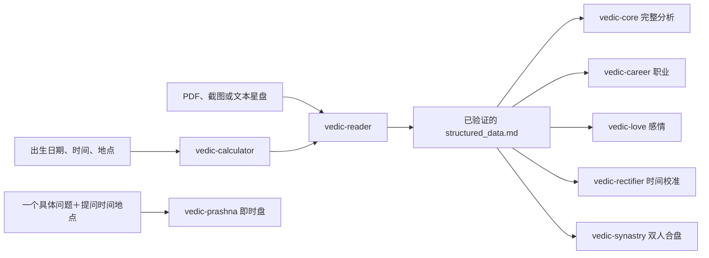

<div align="center">

# 🔱 Vedic Astro Skills

### 从出生信息直接排盘，进入完整吠陀占星分析

**🌐 选择语言 / Choose language / 言語を選択**<br>
**简体中文（当前页）** · [English](README.en.md) · [日本語](README.ja.md)

**输入出生日期、准确时间和地点，即可直接排盘并进入完整分析。**<br>
Enter your birth date, exact time, and place to calculate a Vedic chart and continue directly to a complete analysis.<br>
生年月日・正確な出生時刻・出生地から出生図を直接作成し、そのまま総合鑑定へ進めます。

[中文完整介绍 ↓](#不需要先准备-pdf) · [Full English documentation →](README.en.md) · [日本語ドキュメント →](README.ja.md)

面向 Codex、Claude Code 和 Antigravity 的八模块吠陀占星（Jyotish）Skill 套件。

[](CHANGELOG.md)
[](#环境要求)
[](#八个-skill)
[](LICENSE)

</div>

---

## 不需要先准备 PDF

直接提供出生日期、准确时间和地点，内置计算器就能生成完整星盘数据，完成结构
校验，并继续进入行星、分盘、宫位与人生主题的完整分析。

```text
帮我用吠陀占星排盘并做完整分析。
出生日期：1990-01-01
出生时间：08:00
出生地点：北京市，中国
```

如果已经有 JHora 或其他占星软件导出的 PDF、截图、文本，也可以直接读取。
但文件不是前置条件，从出生信息直接排盘才是这套系统的主要入口。

## 整体工作流



本命分析链路共用一份经过验证的 `structured_data.md`。`vedic-prashna` 是独立的
提问时刻盘，不需要本命盘，也不会自动混入本命分析流程。

## 八个 Skill

| Skill | 功能 | 示例说法 |
|---|---|---|
| `vedic-calculator` | 根据出生信息直接计算完整吠陀星盘 | “帮我排盘，出生日期、时间和地点是……” |
| `vedic-reader` | 读取、标准化并校验 PDF、图片或文本星盘 | “读取并验证这份 JHora 星盘。” |
| `vedic-core` | 执行标准版完整本命审计和十大人生板块分析 | “对这份星盘做完整分析。” |
| `vedic-career` | 分析职业方向、角色适配、优势与时机 | “我的星盘更适合什么职业方向？” |
| `vedic-love` | 分析感情模式、情感需求与关系时机 | “分析我的恋爱模式和时间窗口。” |
| `vedic-rectifier` | 根据人生事件和分盘切换校准出生时间 | “我的出生时间不确定，帮我校准。” |
| `vedic-synastry` | 比较两张星盘的相互激活、关系承载与共同时间 | “帮我看这两个人的合盘。” |
| `vedic-prashna` | 针对一个具体问题建立独立提问时刻盘 | “用 Prashna 看这个具体问题。” |

## 主要能力

- 从出生信息直接排盘，不依赖外部星盘文件。
- 全本命链路共用一份标准化、可校验的数据契约。
- 支持 D1 与分盘、Vimshottari Dasha、原生 MD/AD/PD 边界、Chara Dasha、
  Shadbala、SAV/BAV、复合尊贵度、宫主与 Yoga 数据。
- 本命分析、出生时间校准、双人合盘和 Prashna 各自保持独立工作流。
- 支持中文、英文和日文的对话、信息采集、问卷、进度提示、报告、Q&A、警告
  与 HTML 报告外壳。
- 文件名、schema、CLI 参数和技术标识在不同语言之间保持稳定。
- 同时提供 Codex、Claude Code 和 Antigravity 发行目录。

## 安装

建议一次安装全部八个 Skill。`vedic-calculator` 是多数下游模块使用的计算基座。

### Codex

```bash
git clone https://github.com/CNWU16/vedic-astro-skills.git
cp -r vedic-astro-skills/codex/skills/vedic-* ~/.codex/skills/
```

Skill 本体可以独立运行。为了获得完整推荐的 Codex 执行效果，建议同时安装
`codex-patch`。它负责阶段纪律、用户经历与占星证据隔离、Standard/Pro 报告谱系、
产物路由、出生时间校准护栏和客户成文规则，不会修改任何 Skill 的方法正文。

[查看 Codex 补丁安装说明](codex-patch/README.md)

### Claude Code

```bash
git clone https://github.com/CNWU16/vedic-astro-skills.git
cp -r vedic-astro-skills/claude-code/skills/vedic-* ~/.claude/skills/
```

### Antigravity

把 `antigravity/skills/` 下的八个 `vedic-*` 文件夹复制到正在使用的
Antigravity Skill 目录。

## 快速开始

### 从出生信息开始

```text
帮我排一张吠陀星盘。
出生日期：1990-01-01
出生时间：08:00
出生地点：北京市，中国
```

计算和验证完成后继续说：

```text
用标准版进行完整分析，报告使用中文。
```

### 读取已有星盘

上传 PDF、截图或文本星盘，然后说：

```text
读取并验证这份吠陀星盘。
```

### 双人合盘

提供双方各自经过验证的星盘，或者补充缺少一方的出生信息：

```text
比较这两张星盘，分析双方的合作关系。
```

### Prashna 即时盘

提供一个具体问题、问题正式形成的准确时间和当时所在地点：

```text
针对这个具体问题建立 Prashna 提问盘并判断。
```

古典标准层始终先运行。Tajika 和 KP 是物理、逻辑隔离的可选栈，不会与标准
判定拼票。

## 环境要求

支持 Python **3.8～3.13**。由于天文计算 C 扩展的兼容性限制，当前不支持
Python 3.14。

不要直接裸装 `requirements.txt`，请使用内置环境脚本：

```bash
python path/to/vedic-calculator/scripts/setup_env.py
```

脚本会创建或修复隔离环境，并验证所需的天文与计算依赖。

## 多语言机制

计算、证据、评分、阶段与判断逻辑始终保持单一真源。切换语言只影响对话、信息
采集、报告正文和 HTML 外壳等客户端内容。

- 中文是本仓库默认首页和主要使用语言。
- 英文由共享运行契约直接支持。
- 日文执行时按所选 Skill 加载独立的小型本地化资源，固定术语、敬体、问卷和
  报告标签，不复制算法正文。
- 日文 HTML 使用 `report_builder.py --lang ja`。

规范文件名、`structured_data.md` schema、CLI 参数、JSON key、候选标签、评分、
证据、结论、阶段状态和报告谱系不会随语言改变。

## 仓库结构

```text
antigravity/skills/   发布内容基准
claude-code/skills/   Claude Code 发行版
codex/skills/         Codex 发行版，额外包含 agents/openai.yaml
codex-patch/          推荐的 Codex 执行兼容补丁
scripts/              仓库一致性检查
```

`antigravity/skills/` 是内容基准。Claude Code 必须与其逐文件一致；Codex 只允许
每个 Skill 额外包含一个 `agents/openai.yaml`。

```bash
python3 scripts/check_skill_parity.py
```

## 使用边界

本仓库实现的是传统吠陀占星分析工作流，适用于文化学习、结构化自我探索与研究，
不能替代医疗、法律、金融或其他安全关键领域的专业判断。

## 支持项目

如果这套 Skill 对你有帮助，可以通过微信或支付宝支持后续维护：

<p align="center">
  
  &nbsp;&nbsp;&nbsp;&nbsp;
  
</p>

## License

代码采用 [AGPL-3.0](LICENSE)。个人使用不受额外限制；商业部署还需要遵守
[商业使用说明](COMMERCIAL_NOTICE)。
